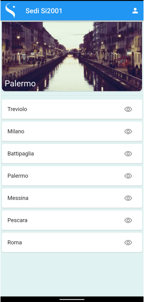

# FlutterCourse

  Flutter è un framework per lo sviluppo cross-platform di app per dispositivi mobili. Con Flutter, è quindi possibile, a partire da un unico codice sorgente, effettuare il deploy dell’applicazione risultante sia su iOS che su Android. In questa corso vedremo tutte le principali caratteristiche di questo framework, lo scopo finale sara' la realizzazione di un app di prenotazione per le presenze nelle sedi di SI2001

## Lezione 1
  ### Plugin 

  - Dart
  - Flutter
  - Dart data

  ### Introduzione Flutter e linguaggio dart
  
  * SKIA, motore grafico
  * HOT RELOAD,permette di apportare modifiche al codice e vederle immediatamente mentre l'app è in funzione.
  * UI personalizzabili grazie a SKIA
  * TREE COMPONENT
  #### Dart 

  * Programmazione oggetti
  * Ereditarieta' multipla (Mixin)
  #### Esercizi Dart

## Lezione 2 - 3
  ### Widget
  Leggi documentazione di Flutter -> [Introduzione Widget](https://docs.flutter.dev/development/ui/widgets-intro)
  #### Esercizi 
  #### Lezione 2

  | Mock Up  | To do |
  | ------------- | ------------- |
  |  |     <ul><li>Una AppBar con un’iconda utente (non funzionante)<li>Corpo della pagina con l’elenco delle sedi<li>Inserire il logo di SI nel logo<li>Al click sul pulsante di un elemento mostreremo il nome della sede selezionata in un contenitore posizionato in cima alla lista</ul> |

  #### Lezione 3
  | Mock Up  | To do |
  | ------------- | ------------- |
  |  |     <ul><li>Creare un tema globale per l’app;<li>Utilizzare ListView e ListTile;<li>Inserire il logo di SI nel logo<li>Creare un’area in cima che visualizzi la sede selezionata, inserire bordi arrotondati nella parte inferiore;<li>Ogni elemento avrà un’immagine presa dal web, inserirla come sfondo nella parte superiore;</ul> |
 
  